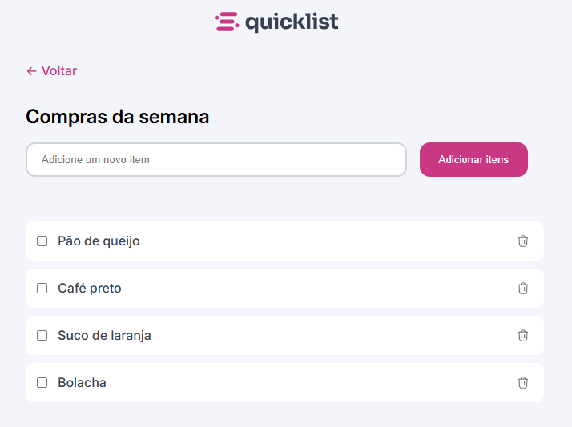

<h1 align="center" style="font-weight: bold;">Travelgram ✈</h1>

<p align="center">
 <a href="#tech">Tecnologias</a> • 
 <a href="#started">Como iniciar</a> • 
  <a href="#colab">Colaboradores</a> 
</p>

<p align="center">
    <b>Projeto criado com o objetivo de treinar e aperfeiçoar os conhecimentos em JS com DOM</b>
</p>

<p align="center">
     <a href="https://robsonlazaro.github.io/Lista-de-Compras/">📱 Visite o Projeto</a>
</p>

<h2 id="layout">🎨 Layout</h2>

<p align="center">
    
</p>

<h2 id="technologies">💻 Tecnologias</h2>

- HTML
- CSS
- JS
  
<h2 id="started">🚀 Como iniciar</h2>

- Clonar o repositório
- Rodar com Live Server ou copiar o caminho do arquivo html e colocar na URL do browser 
<h3> Clonando</h3>

Como clonar o projeto

```bash
git clone https://github.com/RobsonLazaro/Lista-de-Compras.git
```

<h3>Começando</h3>

Como Startar o projeto
- Rodar com Live Server o ```Index.html```

<h2 id="colab">🤝 Colaboradores</h2>

<table>
  <tr>
    <td align="center">
      <a href="#">
        <br>
        <sub>
          <b>Robson Lázaro</b>
        </sub>
      </a>
    </td>

  </tr>
</table>
<hr>
